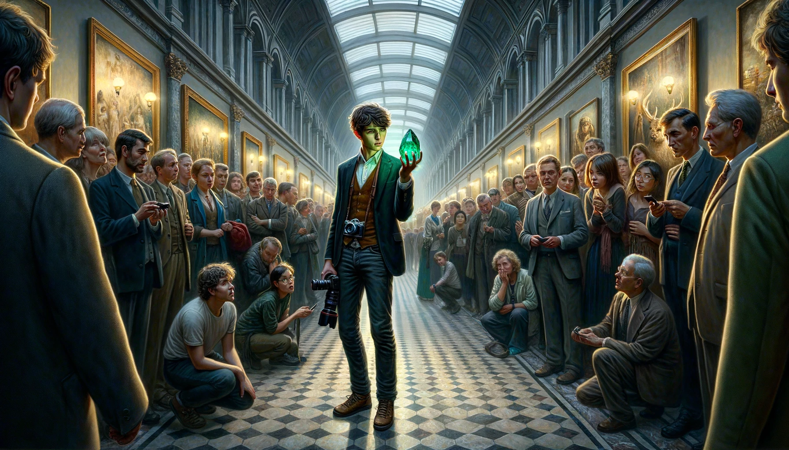

### The Museum Adventure

After watching the recent blockbuster “Museum Adventure”, Ted, a professional photographer who studied history in college, was buzzing with excitement. He loved ancient art, but had never visited the museum since he moved to town.

On the local online forum “Outstapram” Ted posted in the history section, “Anyone up for a museum visit?”. Soon he received several comments. One from a user named *mike007* caught his eye. *mike007* seemed as eager about the museum tour as Ted, so they arranged to meet after a brief conversation.

Ted met this *mike007* guy, he called himself Mike (not surprisingly). Despite the late summer weather, Mike wore a big jacket. He explained to Ted that he had just recovered from a severe cold and needed to stay warm. Their conversation quickly turned to the movie, and Ted was impressed by Mike’s extensive knowledge of ancient art, especially gemstones and porcelain. A uniquely designed “E” logo on Mike’s backpack caught Ted’s attention, Mike explained that it was his college’s Electrical Engineering department logo.

Choosing a weekday for the museum tour was a wise decision. The museum’s vast hallways were nearly empty, making the space feel more expansive. The porcelain glowed softly under the dim lights, appearing to be floating above the darkened bases of their display stands.

Thanks to the help of internet, art is disseminated across the globe. Although Ted was familiar with these collections through photos and digital images, seeing them in person left him in awe.

Not all the exhibits were behind glass. Ted leaned in closely to examine a green emerald before capturing it with his camera. Soon his camera was inundated by photos. He mumbled, “If only I could use flash here, my photos would be so much more vivid.”

“Art evokes our emotional responses by transcending the rational mechanisms,” Mike pointed out. 

Ted was startled; he almost forgot Mike was around.

“They are real … right in front of me. I feel like my life converges with theirs through these collections somehow,” Ted remarked.

Mike nodded in agreement.

When Ted mentioned he needed to go to the bathroom, Mike directed him to an door ajar behind a statue, leading to a dimly lit corridor lined with large wooden crates. At the end, Ted found an unmarked door. As he pushed the door open, an alarm blared!

Ted quickly retreated, but he did not go very far before being cornered by approaching guards. They escorted him to their office, demanding his identification and admonished Ted for entering a restricted area. 

Ted explained that Mike had misled him about the bathroom’s location.

The head guard, Sam, became alert. “Where is this Mike?”, he asked.

As he spoke, the lights went out. 

In the darkness, Ted cried out, “It was Mike! He’s after the collections!”

They pushed chairs and tables away to make their way out of the office. 

“Mike is good with electric stuff, quickly, get me to the power control room!”, Ted said panting. 

Guards split into two groups; Ted followed one group closely to the power control room, the other group started hunting Mike in the hallways.

There was a ladder in front of the power room. Ted and the guards climbed onto it, but the ladder broke, precipitating them down into a heap. Ted heard complaints from the guards. Sam snapped, 

“Stop lamenting and find another way!”

They got back on their feet and found a detour to the room, but Mike was not there. Sam’s walkie-talkie cracked.

“Captain, we’ve caught Mike, what’s next?”

Sam ordered, “check the collections, bring him to the office and I will meet you there.”

Ted followed the rest of the guards back to their office. By the time they got back, the power system was fixed by electricians.

Mike faced confrontation with equanimity. He insisted that he did not do anything wrong, he was just looking for the way out. 

The guards confirmed no collections were missing.

Ted was observing Mike closely, and he noticed a bulge in his pocket. He pulled Sam aside to share a theory. 

“Sam, the most precious and tiny collection in this museum is an emerald, and it’s quite small. Take everyone to the emerald, I think I know what happened. Oh and get me a pair of white gloves.”

The green emerald was sitting on a wooden stand, bathing in the soft light. Everyone was standing around it. Ted wore a pair of gloves. He carefully examined the stone and put it back. Then he spoke out, 

“Mike, did you have a chance to check out this stone when we entered here earlier today?”

Mike said, “Yes.”

“Do you like it?”

“Yes. Who wouldn’t?”

“Yeah, me too. It’s just perfect, all that green. But if you look closer, it has many shades of green, so many that I took dozens of pictures of it, and they all looked different. But today something happened to it. Sam, can you do me a favor and look at the right pocket on Mike’s jacket?”

Everyone focused on Mike’s pocket.

Ted said, “Would you like to take it out, Mike? If you have nothing to hide, of course.”

Mike shurgged, “Sure.” He took it out. It was an emerald exactly like the one on the desk! 

Mike continued, “Hey, this is just a replica. I started to like this emerald since the first time I saw it here, so I carried it with me all the time. Is it against the law to carry a stone I bought from Fbay?”

Ted took the stone and gently put it down on the desk. He said, 

“Generally it is not. But in your case, you see -- the one you took from your pocket is the real emerald, and this”, he took the emerald from the desk, “is just a plain replica”.

The crowd gasped. 

Mike responded with a sneer, “Ted, you do not have anything to substantiate that.”

Ted simply shook his camera.

Mike stood in silence, but cold beads of sweat started to form on his forehead.

Ted continued, 

“You misled me, so I triggered the alert and attracted the guards, leaving a chance for you to sneak over to the power room and shut the electricity. Then you came back here, switched the real stone with your replica. That, is your way of obfuscating everyone. However, your replica was flawed. There was a irregular streak of color on it. I wonder if you have noticed it. Well, I do. Although the streak was as fine as a strand of hair, I saw it. Do you know why? Yes, I am a photographer, I took dozens of photos of this splendid emerald and I know it too well. This flaw was absent in countless photos of the real one, and I am afraid, these photos are hard evidence against you, unfortunately.”

Defeated, Mike crouched down, sat on the ground, with arms around his head, overwhelmed by his failed scheme.

A week later, Ted’s observation skills earned him a part-time job photographing the museums collections he loved. 
What an adventure!

---

*words: admonish, converge, disseminate, equanimity, inundate, lament, obfuscate, precipitate, substantiate, transcend* 

2024.01.09
