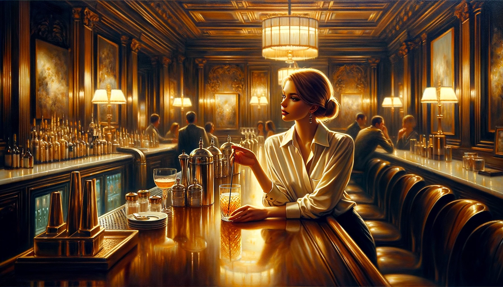

### The Straw Lady

#### Annie

After a graduate degree in finance, I entered a prestigious banking firm as an intern. Light workload, friendly colleagues, and a cafeteria that offered Tiramisu for dessert, hmm, things were cool at first.

Time files when you are happy, Einstein’s relativity rule applies to both work and life. After the internship, things changed. I was a ruthless machine, running between meetings and paperwork. 
So, I went to bars. A sip of cold soda drink made all my pallets dance. This bar, “DeLumos” offered a cozy and laid-back atmosphere with warm ambiance. Yeah, that’s exactly what I needed.

####  Carlos

Another busy day in DeLumos, as usual. My hands were sore after all the drinks every night, but I like to serve as a bartender. People chose to pour their stories to strangers rather than their friends and family. Behind this bar was a front row seat in a theater, where people talk, laugh and get drunk.

Well, nice drinks made a good bartender, but keeping secrets made an outstanding one. 

A girl entered.

“Hi Annie,” I said.

“Hello Carlos,” she smiled back. 

“The usual?”

“Yep, oh and a piece of cheesecake, thank you.”

“Sure, be with you in a sec.”

During her first visit, she asked me for a straw.

“I am sorry, what was that?” 

“A straw,” she grinned, “to sip my drink.”

I had to went through all drawers to get her one. Who the heck drinks with a straw?

But in the next week, she came in every day, asked a straw. 

When the delivery guy threw a pack of 500 straws on my bar, he gave me a funny look.

Well, as long as she was happy, ok for me. Her notebook logo belonged to a big bank near DeLumos. Last time a young fella showed it to me as well. He was too proud to hold the beer steady. What was his name? Oh yes, Hank.

But you can tell Annie was different. She always carried a book and started jogging things down. The pencil moved frantically across the paper. Writing was a rare skill and a hideout from work.

#### Annie

My school life was filled with flowers and applause. My brain was a fine oiled machine; however difficult the problem seemed, **BAM!**, an answer. But things changed. That sense of security was flickering, like a candle flame in the wind holding on for dear life.

These managers turned out to be not so “nice” after all. My direct supervisor, Brad, was a chameleon. The switch from a sycophant around the boss, to an ostentatious jerk to subordinates, was smooth like a steak knife through butter.
Brad often had disparate views on markets and made vitriolic comments to his peers. They adopted dark and clandestine operations to get ahead. I keep watching my back to avoid being dragged into their schemes. This job was walking on a thin thread in mid-air.

#### Carlos

DeLumos was financially unstable. Hank promised to help. What a warm-hearted young fellow. Few days later, he showed me a chart. This investment could drag me out of my financial puddle. 

#### Annie 

A flyer on Carlos’s table had my bank name on it. It was about an investment offer which guaranteed safety. Carlos was happy again as he believed this investment would put the bar back on track. But my gut feeling warned me. 

I gave it a close look at work, it might be a fraud. How could that be? But all evidence pointed to another direction. I needed to put pieces together, but it was surprisingly difficult to do so. My warning did not work either, Carlos already put money in it.

My research revealed Brad was behind this investment offer. To blow the whistle or not, it was a hard choice.

#### Carlos
 
The investment did not pay back as guaranteed. What a huge financial blow. I started selling my furniture on Craigslist. A guy pulled away the table which Annie often sat to. Watching his pick-up truck disappeared around the corner, a chilly wind cut my face. I covered my head in my palms.

Annie came over and lent me some money. We had coffee in my empty bar. Thanks to her generosity, DeLumos was back to business.

#### Annie

There had to be a first warrior to reveal a fraud. Why couldn’t it be me?

Evidence was enough. I locked myself up to finish my findings, but ended up staring at the screen for half an hour. Rubbing my sore eyes, I glanced at the laptop screen; the blank document looked almost like a sneer taunt. 

In my first writing class, my writing tutor, Charlie, encouraged me to write a bunch of trash.

“That’s the essence of writing,” he added.

“Just write, write, and keep writing until you have the first draft. Do not let the resistance hold you back. When you have the first draft, you already have at least 30% of success under your belt. The first draft is the most difficult thing to have, ever!”

“Annie, I want you to be a superb writer,” Charlie continued, “The first draft is always a great point to start.”

Charlie’s soothing and mellifluous voice calmed me down. 

Frankly I was antsy before the class, because I had no words on my paper. Charlie said,

“Modifying is the key. The good news is, modifying a draft is way easier than creating one on a blank page. Our mind is subconsciously assured when we work on a draft, because we have something to hold onto. At least this works perfect for me. An article could always be better. I like this idea: an article is never finished; it is only abandoned. Good luck!”

Charlie’s method was hard at first. I persevered and eventually tossed the irrational belief that one should not write anything unless it is perfect. My door of creativity was pushed open.

I finished my discovery of Brad’s fraud in a few days and mailed it to local newspapers and TV stations. Being an iconoclast was not that bad after all! Hundreds of victims called me to show their support; a few ex-colleagues made vicious comments but I trashed their messages. 

I was true to my conscience, that what mattered.

Hank came to me and Carlos in DeLumos. He asked Carlos for forgiveness, the became furious that Brad tricked him to advocate that fraud investment. However, he hesitated about testifying as an impeached witness.

Carlos went to court against the bank on behalf of all victims. At first our ass was being kicked. Later on, Hank testified and provided key evidence, which won the judge’s heart.

After the trial, the bank paid Carlos’s money back. I became an independent researcher and published papers and reports that helped investors. They called me “the straw lady” after the newspaper published a full-page article about the trial and used a picture of me sipping coffee through a straw in the courtroom.

Carlos invited me over to celebrate in DeLumos. Hank poured me a hot chocolate. Of course, he lost his job in the bank, but he was found not-guilty in the trial and soon got another position in the market. I was happy to see him back on track. We cheered for him.

“I have something too,” I revealed that I passed the bar exam on my way to be a lawyer in the financial field.

Carlos hand me a fine wooden box. I snapped the lid open. A golden straw laid on the black velvet. 

It was heavy. I slowly examined it in the soft orange light and saw small letters near the bottom. They were deeply carved in the gold:

**“To Annie, our best straw lady.”**

---

*words: ephemeral， sycophants， ostentatious， vitriolic， clandestine， banal， mellifluous， proclivity， iconoclast, disparate* 

2024.01.22
